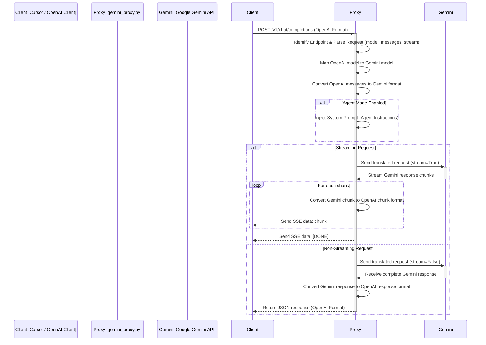

# Gemini Proxy for Cursor: Detailed Explanation

This document provides a detailed explanation of the `gemini_proxy.py` script, a Flask-based proxy server designed to interface between OpenAI-compatible clients (like Cursor) and Google's Gemini API.

## 1. Overview

The primary purpose of this proxy is to allow applications built for the OpenAI API to leverage Google's Gemini models without significant modification. It achieves this by:

1.  **Intercepting OpenAI API requests:** Listens for requests on standard OpenAI endpoints (`/v1/chat/completions`) and Cursor-specific endpoints (`/chat/completions`).
2.  **Translating Request Formats:** Converts the incoming OpenAI message and parameter structure into the format expected by the Gemini API.
3.  **Interacting with Gemini API:** Sends the translated request to the appropriate Gemini model using the `google-generativeai` library.
4.  **Translating Response Formats:** Converts the Gemini API's response (both streaming and non-streaming) back into the OpenAI format.
5.  **Handling Streaming:** Correctly manages Gemini's streaming responses and formats them as Server-Sent Events (SSE) expected by OpenAI clients.
6.  **Model Mapping:** Maps requested OpenAI model names (e.g., `gpt-4o`) to corresponding Gemini model names (e.g., `gemini-2.5-pro-exp-03-25`).
7.  **Agent Mode:** Injects a system prompt (loaded from `CursorSystemPrompt.md`) to enable more complex, tool-using agent behavior.
8.  **Auto-Continuation:** Attempts to automatically continue agent tasks after a tool call by managing conversation state and injecting continuation prompts.
9.  **Configuration & Logging:** Uses environment variables for configuration and provides detailed logging.
10. **(Optional) Ngrok Integration:** Can automatically create a public URL using ngrok for easier integration with cloud-based clients or testing.

## 2. Core Workflow

The following diagram illustrates the basic request/response flow through the proxy:



## 3. Key Components and Features

### 3.1. Flask Application (`app`)

-   Uses the Flask framework to create the web server.
-   Uses `Flask-CORS` to handle Cross-Origin Resource Sharing, allowing requests from different domains (necessary for web-based clients like Cursor).
-   Defines routes to handle incoming requests.

### 3.2. Configuration (`.env`, Environment Variables)

-   **`GOOGLE_API_KEY`**: Essential for authenticating with the Gemini API.
-   **`LOG_LEVEL`**, **`LOG_RAW_DATA`**, etc.: Control logging verbosity and behavior.
-   **`MODEL_MAPPINGS`**: Defines the translation between OpenAI and Gemini model names. `MODEL_MAPPINGS` in the code (`1:975:CursorCustomModels/src/gemini_proxy.py`) defines the default mappings.
-   **`API_TIMEOUT`**, **`MAX_RETRIES`**: Network settings for API calls (though retries aren't explicitly implemented in the `run_gemini_completion` function shown).
-   **`AGENT_MODE_ENABLED`**: Toggles the injection of the agent system prompt.
-   **`AUTO_CONTINUATION_ENABLED`**, **`AUTO_CONTINUATION_MAX_TURNS`**: Control the automatic continuation feature for agent mode.
-   **`PORT`**, **`HOST`**, **`USE_NGROK`**: Server and ngrok configuration.

### 3.3. Logging

-   Uses Python's `logging` module.
-   Configured via environment variables (`LOG_LEVEL`).
-   Logs general information, warnings, and errors to `proxy.log` and the console.
-   Includes a separate `raw_logger` (`1:975:CursorCustomModels/src/gemini_proxy.py`) to log raw request/response data (if `LOG_RAW_DATA` is enabled) primarily to the console for debugging, with truncation for large payloads.

### 3.4. Request Handling

-   **Routes:**
    -   `/v1/chat/completions`: Standard OpenAI endpoint.
    -   `/chat/completions`: Cursor-specific endpoint.
    -   `/<path:path>/chat/completions`: Handles potential custom path prefixes.
    -   `/agent`: Specific endpoint that *always* runs in agent mode.
    -   `/v1/models`: Mimics the OpenAI models listing endpoint.
    -   `/debug`: Provides basic status and configuration info.
    -   `/`: Simple HTML home page.
    -   Handles `OPTIONS` requests for CORS preflight checks.
-   **`process_chat_request()` (`1:975:CursorCustomModels/src/gemini_proxy.py`)**: Central function that handles the logic for all chat completion endpoints. It parses the request, manages conversation state for auto-continuation, calls `run_gemini_completion`, and formats the response.

### 3.5. Gemini Integration (`run_gemini_completion`)

-   **`map_openai_model_to_gemini()` (`1:975:CursorCustomModels/src/gemini_proxy.py`)**: Selects the appropriate Gemini model based on the request.
-   **`convert_openai_messages_to_gemini()` (`1:975:CursorCustomModels/src/gemini_proxy.py`)**: Translates the message history. It extracts the system prompt and converts user/assistant roles to Gemini's user/model roles. Function call *results* are passed as user messages.
-   **Gemini Client Initialization:** Configures the `genai.GenerativeModel` with the API key, model name, safety settings (set to `BLOCK_NONE` for fewer restrictions), and generation config (temperature, top_p, etc.).
-   **System Prompt Injection:** If `AGENT_MODE_ENABLED` is true or the `/agent` endpoint is used, the content of `AGENT_INSTRUCTIONS` (loaded by `load_system_prompt`) is prepended to the conversation history or set via `model.system_instruction`.
-   **API Call:** Uses `model.start_chat()` and `chat.send_message()` to interact with the Gemini API. A placeholder message like "Continue the conversation." is used as Gemini doesn't accept empty messages.
-   **Error Handling:** Wraps the Gemini API call in a try-except block to catch errors and return them in a valid OpenAI error format.

### 3.6. Response Handling & Streaming

-   **Non-Streaming:**
    -   `gemini_content_to_openai_response()` (`1:975:CursorCustomModels/src/gemini_proxy.py`): Takes the complete text response from Gemini and wraps it in the standard OpenAI JSON structure, including generating IDs, timestamps, and basic usage stats (though token counts are currently zeroed out).
-   **Streaming:**
    -   The `generate_streaming_response()` generator function (`1:975:CursorCustomModels/src/gemini_proxy.py`) inside `run_gemini_completion` handles streaming.
    -   It iterates through the chunks received from `chat.send_message(..., stream=True)`.
    -   `gemini_streaming_chunk_to_openai_chunk()` (`1:975:CursorCustomModels/src/gemini_proxy.py`): Converts each Gemini text chunk into the OpenAI streaming chunk format (`delta: {"content": "..."}`).
    -   Yields each formatted chunk as an SSE `data:` line.
    -   Sends a final chunk with `finish_reason: "stop"`.
    -   Yields the SSE termination signal `data: [DONE]\n\n`.
    -   Uses `flask.Response(..., mimetype='text/event-stream')` to return the streaming response.

### 3.7. Agent Mode & System Prompt

-   **`AGENT_MODE_ENABLED`**: If true, the proxy attempts to make Gemini behave more like a coding agent.
-   **`load_system_prompt()` (`1:975:CursorCustomModels/src/gemini_proxy.py`)**: Attempts to load instructions from `CursorSystemPrompt.md` located relative to the script. This file should contain the core instructions defining the agent's behavior, capabilities (like tool use), and persona.
-   **`AGENT_INSTRUCTIONS`**: Stores the loaded system prompt.
-   **Injection:** The `AGENT_INSTRUCTIONS` are added to the Gemini request either as part of the initial system message or via the `model.system_instruction` property. This guides the model's responses.

### 3.8. Auto-Continuation (Agent Mode)

-   **Goal:** Allow the agent to automatically continue its task after using a tool, without requiring explicit user intervention for each step.
-   **Mechanism:**
    1.  **Detect Tool Request:** `extract_tool_call_requests()` (`1:975:CursorCustomModels/src/gemini_proxy.py`) attempts to find patterns indicating a tool call in the Gemini response *before* sending it to the client. If found, the tool name is stored in `last_tool_call` cache associated with the `conversation_id`. *Note: This implementation is simplified and relies on text pattern matching, which might not be robust.*
    2.  **Track Conversation State:** The `continuation_counter` cache tracks how many auto-continuation steps have occurred for a conversation. `last_tool_call` stores whether the last model response requested a tool.
    3.  **Trigger Continuation:** In `process_chat_request`, if `AUTO_CONTINUATION_ENABLED` is true, the proxy checks if:
        -   The incoming request contains a function/tool result message OR
        -   There was a recent tool call detected (`last_tool_call`) for this conversation, no new user message has been added since, and the `continuation_counter` is below `AUTO_CONTINUATION_MAX_TURNS`.
    4.  **Inject Continuation Prompt:** If triggered, a system message like "Continue from where you left off..." is appended to the messages sent to Gemini (`1:975:CursorCustomModels/src/gemini_proxy.py`).
    5.  **Increment Counter:** `continuation_counter` is incremented.
    6.  **Reset:** The counter is reset if a non-continuation request (e.g., a new user message) comes in.

-   **Diagram:**

```mermaid
graph TD
    A[Client Sends Request] --> B{Process Request};
    B --> C{Is Auto-Continuation Enabled?};
    C -- No --> D[Run Gemini Completion Normally];
    C -- Yes --> E{Is it a Tool Result OR (Recent Tool Call AND No User Msg AND Limit Not Reached)?};
    E -- No --> D;
    E -- Yes --> F[Inject "Continue..." Prompt];
    F --> G[Increment Continuation Counter];
    G --> H[Run Gemini Completion];
    D --> I[Format & Send Response];
    H --> I;

    subgraph Caching
        direction LR
        J[last_tool_call]
        K[continuation_counter]
    end

    style F fill:#f9d,stroke:#333,stroke-width:2px
    style G fill:#f9d,stroke:#333,stroke-width:2px
```

### 3.9. Caching (`cachetools.TTLCache`)

-   **`request_cache`**: Short-term cache (5s TTL). *Purpose unclear from the provided code snippet, potentially intended for deduplication but not actively used in the core logic shown.*
-   **`streaming_tracker`**: Short-term cache (10s TTL). *Purpose unclear from the provided code snippet, potentially intended for tracking active streams but not actively used in the core logic shown.*
-   **`code_edit_cache`**: Tracks recent code edits (5min TTL). *Purpose unclear, likely intended for preventing repetitive edits but not actively used in the core logic shown.*
-   **`file_edit_counter`**: Tracks consecutive edits to the same file (10min TTL). *Purpose unclear, likely intended for preventing problematic edit loops but not actively used in the core logic shown.*
-   **`continuation_counter`**: Tracks auto-continuation turns per conversation (30min TTL). Used in the auto-continuation logic.
-   **`last_tool_call`**: Stores the name of the last detected tool call per conversation (5min TTL). Used in the auto-continuation logic.

### 3.10. Ngrok Integration (`start_ngrok`)

-   Activated by setting `USE_NGROK=1`.
-   Checks if `ngrok` is installed and in the system's PATH.
-   Starts an `ngrok http` tunnel for the proxy's port.
-   Fetches the public HTTPS URL from the ngrok agent API (`http://localhost:4040/api/tunnels`).
-   Prints the public URL, inspector URL, and example `curl`/`PowerShell` commands to the console.
-   This allows the locally running proxy to be accessed from the internet, which is often necessary for cloud-based IDEs or services.

### 3.11. Graceful Shutdown

-   Uses Python's `signal` module to register handlers for `SIGINT` (Ctrl+C) and `SIGTERM`.
-   The `signal_handler` function logs a shutdown message and exits cleanly.

## 4. Running the Proxy

1.  **Prerequisites:** Python 3.x, `pip`.
2.  **Dependencies:** Install required packages (likely listed in a `requirements.txt` file, though not shown): `Flask`, `requests`, `python-dotenv`, `google-generativeai`, `waitress`, `Flask-Cors`, `cachetools`, `ngrok` (optional, installed separately).
3.  **Configuration:**
    -   Create a `.env` file in the same directory (or a parent directory).
    -   Add `GOOGLE_API_KEY=YOUR_GEMINI_API_KEY`.
    -   Set other environment variables as needed (e.g., `USE_NGROK=1`, `AGENT_MODE_ENABLED=1`).
4.  **System Prompt:** Create a `CursorSystemPrompt.md` file with the desired agent instructions if using Agent Mode.
5.  **Run:** Execute `python gemini_proxy.py`.
6.  **Client Configuration:** Configure your client (e.g., Cursor) to use the proxy's URL (e.g., `http://localhost:5000` or the ngrok public URL) as the OpenAI API base URL. Use a dummy API key if required by the client. Select one of the mapped model names (e.g., `gpt-4o`).

## 5. Limitations & Considerations

-   **Tool Call Detection:** The current method `extract_tool_call_requests` uses basic regex matching on the *text* output of the Gemini model. This is fragile and might miss or incorrectly identify tool calls, especially if the model's output format changes. A more robust solution would involve Gemini's native function calling features if/when fully integrated.
-   **Token Usage:** The proxy currently zeroes out token usage (`prompt_tokens`, `completion_tokens`) in the response. Actual token counts are not retrieved from the Gemini API.
-   **Error Mapping:** While basic error handling exists, detailed mapping of Gemini errors to specific OpenAI error codes is not implemented.
-   **Feature Parity:** Not all OpenAI API features (like logprobs, fine-tuning specifics, etc.) are necessarily mapped or supported.
-   **Caching Usage:** Several defined caches (`request_cache`, `streaming_tracker`, `code_edit_cache`, `file_edit_counter`) don't appear to be actively used in the core request/response flow shown in the snippet, suggesting they might be remnants of previous features or intended for future implementation.

This detailed breakdown should provide a comprehensive understanding of how the `gemini_proxy.py` script functions.
